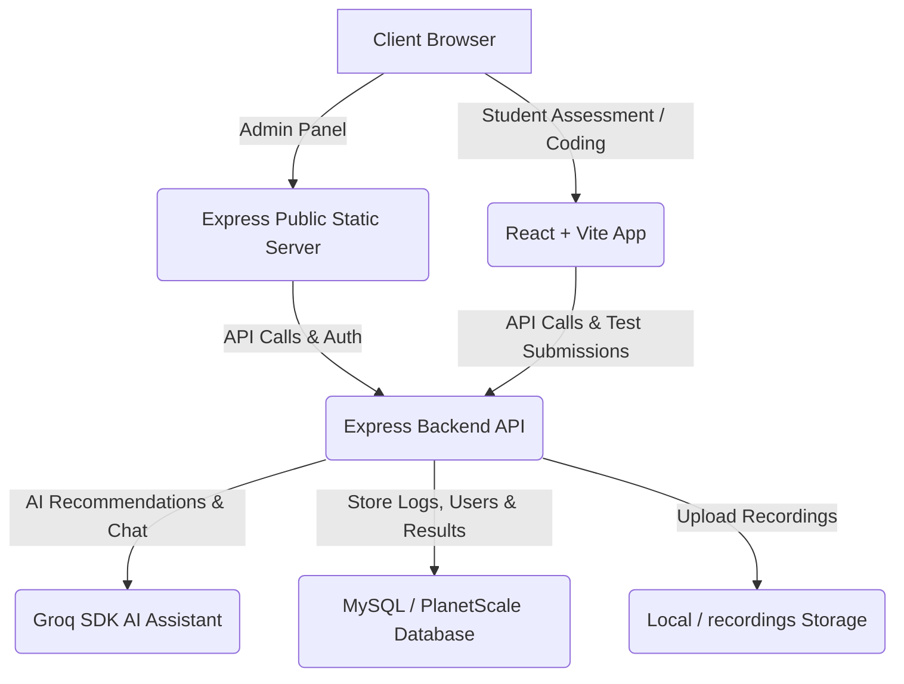

# 🌌 Aethon: AI-Powered Assessment & Remote Proctoring Platform

Aethon is a high-fidelity, full-scale online assessment and automated proctoring platform designed to ensure academic integrity in remote examinations. Powered by **Groq AI** for administrative assistance and utilizing state-of-the-art client-side proctoring mechanisms, Aethon provides a robust environment for both test-takers and administrators.

The interface adheres strictly to the **"Aurora" Glassmorphism UI Design System**, featuring a deeply saturated neon-infused dark purple theme, smooth blur effects, and glow micro-animations.

---

## 🏗️ Architecture Overview

Aethon is structured as a hybrid web application to optimize both static administrative dashboard loading and interactive real-time assessment portals.



- **Backend (`server.js`):** Express.js API handling authentication, student registry, assessment setups, feedback loop, AI chatbot assistant (Groq), database connectivity, and proctoring log/video uploads.
- **Admin Dashboard (`public/`):** A collection of lightweight, blazing-fast static HTML, CSS, and JS files utilizing the Aethon Glassmorphism theme to monitor sessions, create assessments, customize proctoring controls, and check logs.
- **Student Portal (`react-app/`):** A React + Vite web application containing interactive MCQ interfaces, code editors with sandbox input/outputs, and active proctoring state machines.

---

## 🌟 Key Features

### 1. Robust Proctoring Engine
Customizable, strict rules that can be enabled per-assessment in the administration panel:
*   **Fullscreen Lock:** Force users to stay in fullscreen; automatically submits or logs violations if exited.
*   **Tab Switch Detection & Limits:** Detect when a user switches tabs. Configurable limits (e.g., max 3 tab switches) before auto-submitting.
*   **Hover/Window Focus Detection:** Log when a user hovers outside of the browser window.
*   **Copy-Paste Block:** Disable copy-paste commands on the test page to prevent code sharing.
*   **Media Proctoring:** Request webcam/microphone access and record the session via MediaRecorder API, uploading `.webm` recordings directly to the backend.

### 2. Interactive Student Portal
*   **Multiple Assessment Formats:** Supports Multi-Section Assessments including MCQs (Multiple Choice) and hands-on coding challenges.
*   **Integrated Code Runner:** Write code, view sample input/outputs, and execute against testcases.
*   **Practice Section:** Assigned practice rooms for students to hone their coding and analytical skills.

### 3. Comprehensive Admin Panel
*   **Assessment Builder:** Add/remove sections, insert MCQ options, define correct answers, set difficulty levels, and configure coding test cases (visible and hidden).
*   **Live Violation Monitor:** Real-time logging of proctoring events with video playback tools.
*   **Aethon AI Chatbot:** An embedded chatbot on the admin panel powered by Groq SDK that answers questions, analyzes test metrics, and builds SQL query blueprints.
*   **Feedback Analytics:** Collect and view platform reviews, difficulty ratings, and issues submitted by students.

---

## 🛠️ Technology Stack

- **Backend:** Node.js, Express.js, Multer (for video/file uploads), JWT (Authentication), Cookies, Bcrypt (Password Hashing).
- **Frontend:** HTML5, CSS3 (Vanilla Glassmorphism), Javascript (ES6), React, Vite.
- **Database:** MySQL / PlanetScale via `mysql2` connection pool.
- **AI Engine:** Groq SDK (Llama models) for admin analytics support.

---

## ⚙️ Environment Variables Setup

Create a `.env` file in the root directory:

```env
# Groq AI Assistant API Key
GROQ_API_KEY=your_groq_api_key_here

# Database Configuration (For localhost or cloud provider like PlanetScale)
DB_HOST=localhost
DB_USER=root
DB_PASSWORD=your_password
DB_NAME=portfolio

# JWT Signing Secret
JWT_SECRET=supersecretkey123
```

---

## 🚀 Installation & Local Running

### Prerequisites
- Node.js (v16.0.0 or higher)
- A running MySQL instance (XAMPP, Docker, or native service)

### 1. Database Setup
1. Open your database manager (e.g., phpMyAdmin) and create a database named `portfolio`.
2. Import [schema.sql](file:///c:/Users/sivar/Downloads/portfolio/portfolio/schema.sql) into your database to construct all structural tables.

### 2. Backend Installation & Run
1. Navigate to the project root directory:
   ```bash
   npm install
   ```
2. Start the Express server:
   ```bash
   npm start
   ```
   *The server will start on port `3000`.*

### 3. Frontend (React Student Portal) Setup
1. Navigate to the `react-app` directory:
   ```bash
   cd react-app
   npm install
   ```
2. Start the React/Vite development server:
   ```bash
   npm run dev
   ```
   *The client will run on port `5173` (by default).*

### 4. Portals Access Paths
- **Admin Panel:** Open the browser and direct to `http://localhost:3000/admin.html` (or serve `public/` files through your workspace extension).
- **Student Assessment Portal:** Handled by the React application on `http://localhost:5173`.

---

## 📦 Deployment

### Production Rewrite Config (Vercel)
A [vercel.json](file:///c:/Users/sivar/Downloads/portfolio/portfolio/public/vercel.json) file is supplied in the `public` directory to route front-end requests to the backend server seamlessly:
```json
{
  "version": 2,
  "rewrites": [
    {
      "source": "/(.*)",
      "destination": "https://YOUR_RENDER_BACKEND_URL.onrender.com/$1"
    }
  ]
}
```
*Simply replace `https://YOUR_RENDER_BACKEND_URL.onrender.com` with your production API URL.*

---

## 🔧 Maintenance & Utility Scripts

To assist with local testing, schema configuration, and system maintenance, several scripts are included in the root folder:

| Script Name | Purpose |
| :--- | :--- |
| `schema.sql` | Contains the complete relational database layout and definitions. |
| `db.js` | Main database engine. Auto-creates columns and handles sandbox cleanup on launch. |
| `check_admins.js` / `fix_admin.js` | Quickly verifies, seeds, or repairs administrator emails/passwords. |
| `scratch_insert_dummy_data.js` | Generates sample student, assessment, and question rows for prototyping. |
| `scratch_migrate_passwords.js` | Performs database-wide encryption transitions to bcrypt hashes. |
| `inject_agent.js` / `fix_inject.js` | Configures and tests prompt injections for the administrative AI model. |
| `scratch_check_db.js` / `scratch_check_data.js` | Performs diagnostic health checks on table counts and connections. |

---

## 📜 License
This project is proprietary. All rights reserved. Refer to setup guidelines for hosting authorizations.
